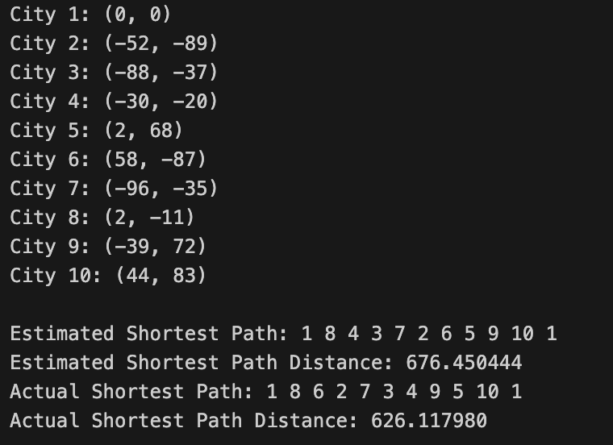

<h1>The Travelling Salesman Problem</h1>

Here, 10 cities are created with a set of randomly generated coordinates, starting from the origin. The solution uses a Branch and Bound algorithm. The upper bound for the size of the path to be travelled is calculated from a Greedy Nearest Neighbor Algorithm.

<h2>Example:</h2>
